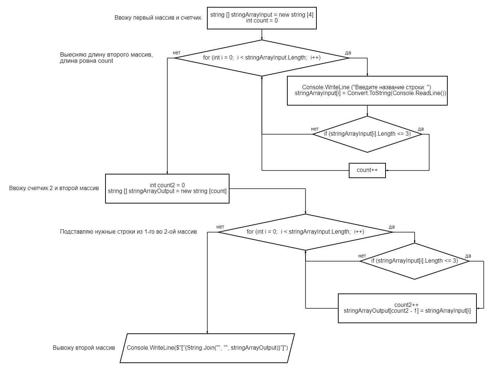

# Итоговая контрольная работа
## Задача
### Написать программу, которая из имеющегося массива строк формирует новый массив из строк,длина которых меньше, либо равна 3 символам. Первоначальный массив можно ввести с клавиатуры, либо задать на старте выполнения алгоритма. При решении не рекомендуется пользоваться коллекциями, лучше обойтись исключительно массивами.
### Примеры:
    [“Hello”, “2”, “world”, “:-)”] → [“2”, “:-)”]
    [“1234”, “1567”, “-2”, “computer science”] → [“-2”]
    [“Russia”, “Denmark”, “Kazan”] → []
### 1.
Добавляем первый массив и счетчик:

    string [] stringArrayInput = new string [4]
    int count = 0

Выесняем длинну 2-го массива:

    for (int i = 0; i < stringArrayInput.Length; i++)
Вводим  названия для массива:

    Console.WriteLine("Введите название строки: ");
    stringArrayInput[i] = Convert.ToString(Console.ReadLine());
Проверяем чтобы длинна строки была меньше или ровна 3:

    if (stringArrayInput[i].Length <= 3)
    {
            count++ ;
    }
### 2.
Добавляем счетчик 2 и второй массив:

        int count2 = 0;
        string [] stringArrayOutput = new string [count];
    
Подставляем нужные строки из 1-го во 2-ой массив:

    for (int i = 0; i < stringArrayInput.Length; i++)
    {
        if (stringArrayInput[i].Length <= 3)
        {
            count2++ ;
            stringArrayOutput[count2 - 1] = stringArrayInput[i];
        }
    }
### 3.
Выводим второй массив:

    Console.WriteLine($"[“{String.Join("”, “", stringArrayOutput)}”]");

## Блок-схема
